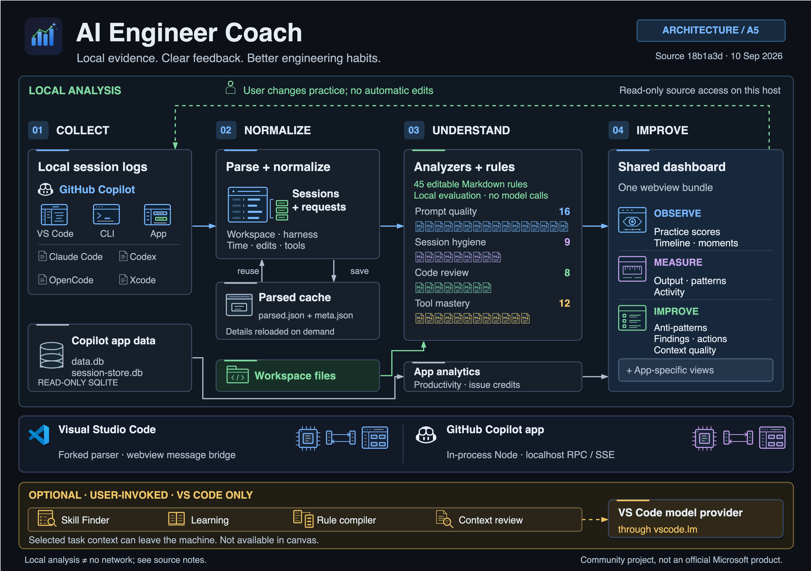
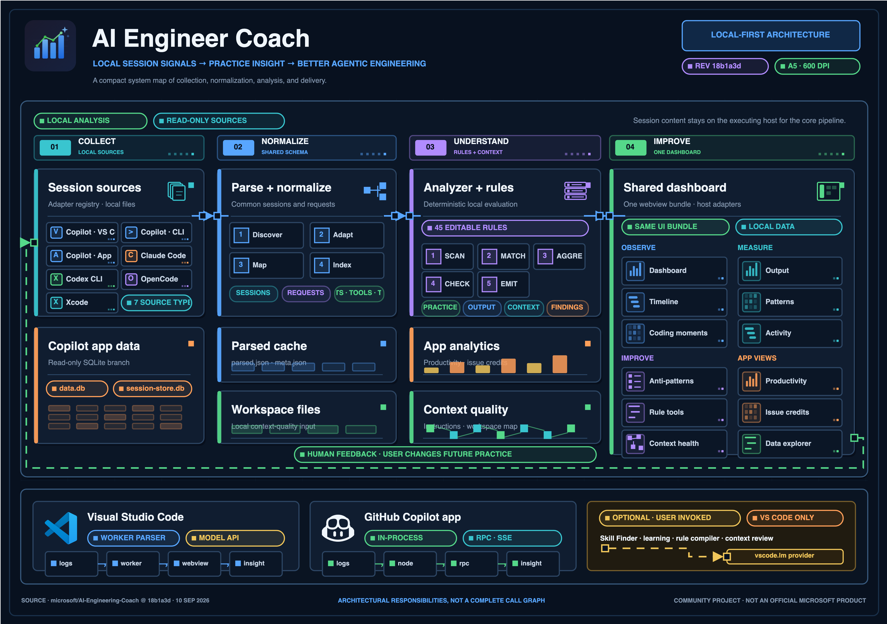

# Skills

My reusable agent skills.

## Skills

| Skill | Purpose |
| --- | --- |
| [Differential regression review](skills/differential-regression-review/SKILL.md) | Compare base and pull request behavior with temporary end-to-end tests. |
| [Draw.io pitch](skills/drawio-pitch/SKILL.md) | Research the subject and visual direction, then create a dense A5 diagram and PNG. |
| [Draw.io iterate](skills/drawio-iterate/SKILL.md) | Complete at least four PNG review passes: an 800% diagram-code increase, then corrections only. |

Use `drawio-pitch` for the initial proposal, then `drawio-iterate` to refine it.
The skills do not prescribe a visual style or PNG export tool.
Differential regression review requires Git and the target project's test dependencies.

## Install

From a local checkout, use GitHub CLI 2.90.0 or later:

```bash
gh skill install . --all \
  --from-local --agent github-copilot --scope user
```

To install one skill, replace `--all` with its name.

## Diagram samples

**Recommended model: GPT-6 Astra.** It delivered the best result in this comparison.
Both models refined the same AI Engineer Coach draft through four
`drawio-iterate` passes.

### GPT-6 Astra



<details>
<summary>GPT-5.6 Sol reference output</summary>

Kept for comparison only. This version has clipped labels and omits some
secondary connectors that are present in the Astra result.



</details>

[Source and asset credits](samples/NOTICE.md).

## Source and license

Differential regression review is copied unchanged from
[aymenfurter/differential-regression-review](https://github.com/aymenfurter/differential-regression-review/tree/d2304f1292473cd6708a61bbadffa36760f41ce7).

[MIT License](LICENSE). Each skill directory also includes the license for
standalone distribution.
